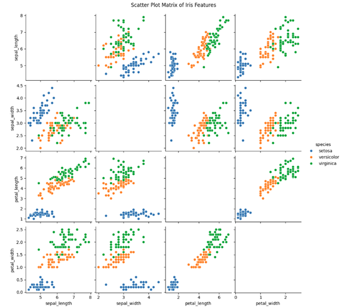
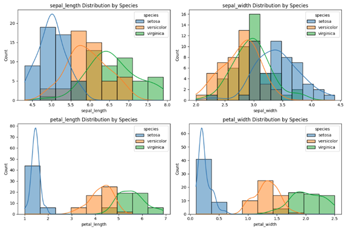
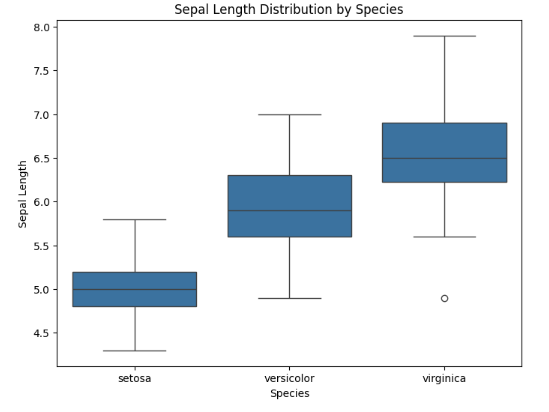
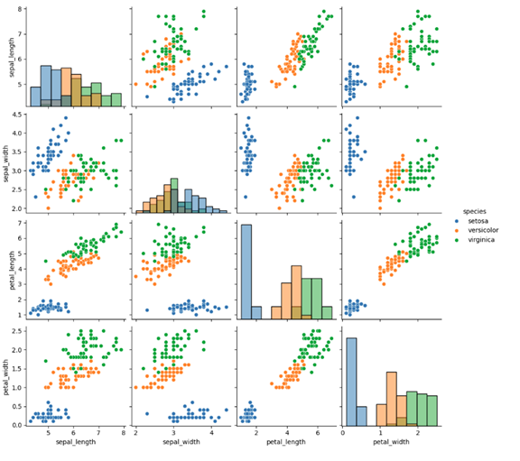
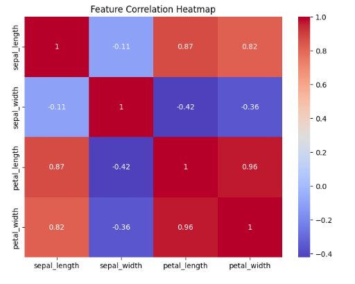

# 📊 Data Science Internship Tasks

This repository contains tasks completed during my Data Science Internship.
The focus is on **data analysis, visualization, and extracting meaningful insights** using real-world datasets.

---

## 🧑‍💻 Tools & Technologies

* Python
* Pandas
* Matplotlib
* Seaborn
* Jupyter Notebook

---

## 📁 Repository Structure

```
data-science-internship-tasks/
│
├── Task-01-Iris-EDA/
│   ├── iris_analysis.ipynb
│   ├── screenshots/
│   │   ├── scatter.png
│   │   ├── histogram.png
│   │   ├── boxplot.png
│   │   ├── pairplot.png
│   │   └── heatmap.png
│   └── README.md
│
├── Task-02-...
│
└── README.md
```

---

## 📌 Task 1: Iris Dataset Exploration & Visualization

### 🎯 Objective

To explore and visualize the Iris dataset using Python libraries and extract meaningful insights.

---

### 📊 Key Steps Performed

* Loaded dataset using Pandas
* Explored dataset structure (`shape`, `columns`, `head`)
* Generated summary statistics
* Created visualizations:

  * Scatter plots (feature relationships)
  * Histograms (data distribution)
  * Box plots (outliers and spread)
  * Pairplot (overall feature relationships)
  * Heatmap (feature correlation)

---

### 📸 Visualizations

#### 🔹 Scatter Plot Matrix



#### 🔹 Histograms



#### 🔹 Box Plot



#### 🔹 Pairplot



#### 🔹 Correlation Heatmap



---

### 📈 Key Insights

* Petal length and petal width show **strong positive correlation**
* Petal features are the most effective for **distinguishing species**
* Setosa species is **clearly separable** from others
* Versicolor and Virginica show **partial overlap**
* Some features may be **redundant due to high correlation**
* Dataset contains **no missing values**, making it clean and reliable

---

## 🚀 Future Work

* Apply machine learning models (KNN, Logistic Regression)
* Perform feature selection and dimensionality reduction
* Extend analysis to additional datasets

---

## 👩‍💻 Author

**Nayab**
BS Data Science Student

---

## ⭐ Note

This repository is part of my data science learning journey and will be updated with more tasks and projects.

---
